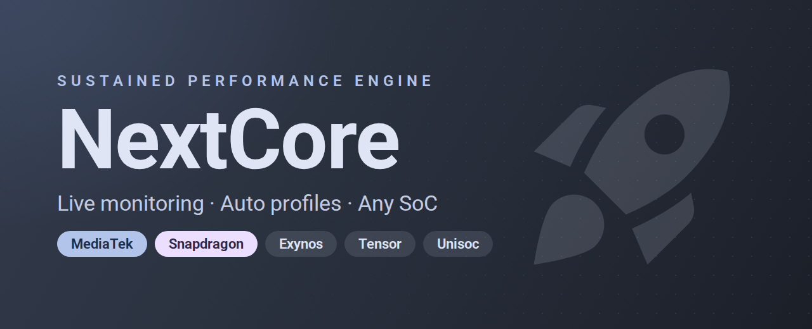

<p align="center">
  
</p>

<p align="center">
  <a href="https://github.com/ifoknr/NEXTCORE/releases/latest"></a>
  
  
  
</p>

<p align="center"><a href="#english">English</a> · <a href="#العربية">العربية</a></p>

---

<div dir="rtl">

## العربية

**NextCore** موديول أداء لـ KernelSU وAPatch وMagisk، ومعه تطبيق لإدارته ومراقبة الجهاز. يتعرّف على معالجك عند كل إقلاع ويطبّق التحسينات المناسبة له، ويبدّل ملف الأداء لحاله لما تفتح لعبة.

### ⚡ ملف الأداء: أداء مستدام

بدل ما يقفل كل الأنوية على أعلى تردد من أول ثانية، ملف الأداء يرفع أقل تردد ويخلي حاكم المعالج يرفع الباقي حسب الحمل. الجهاز يسخن أبطأ، فتطول الفترة اللي تلعب فيها على أعلى أداء.

| البند | كيف يشتغل |
| :--- | :--- |
| **المعالج** | أقل تردد يصير 70% من الأقصى للأنوية الكبيرة و50% للمجموعة الصغيرة، وأعلى تردد بدون حد. حاكم الجهاز الأصلي يكمل شغله فوق هذا الحد. |
| **أولوية اللعبة** | uclamp على نواة GKI: التطبيق اللي على الشاشة يُعامل كأنه محمّل 30% على الأقل فيروح للأنوية السريعة، ومهام الخلفية محدودة بنص قدرة النواة. على الأنوية القديمة يستخدم schedtune. |
| **كرت الرسوميات** | ما ينقفل على أعلى تردد. على MediaTek يرفعه FPSGO وGED حسب وقت كل إطار. |
| **الحرارة والبطارية** | الحماية كلها شغالة. EARA على MediaTek ينزل التردد شوي شوي لما يسخن الجهاز عشان الإطارات تبقى ثابتة. |
| **الذاكرة والتخزين** | ما يمسح ذاكرة التخزين المؤقت مع كل تبديل، والقراءة المسبقة 256 كيلوبايت لتحميل أسرع. |
| **الرجوع للتوازن** | ملف التوازن يرجّع قيم uclamp الأصلية حقت جهازك، والموديول يحفظها عند الإقلاع. |

**الأداء الأقصى (اختياري):** من التعديلات ← الإعدادات الإضافية ← الأداء الأقصى. يقفل المعالج وكرت الرسوميات على أعلى تردد ويخفف حماية الحرارة. أسرع في أول دقايق، والجهاز يسخن أكثر.

### 🧩 يشتغل على أي معالج

عند كل إقلاع يقرأ الموديول معالجك ويكتب النتيجة في `device_profile`:

1. من `ro.soc.manufacturer` و`ro.soc.model`، وهي أدق شي على الأجهزة الحديثة.
2. لو ما نفعت، من `/proc/cpuinfo` ثم `ro.board.platform`.
3. لو الاسم ما يدل على شي، من تعريفات النواة الموجودة: `gpufreq` و`fpsgo` و`ppm` تعني MediaTek، و`kgsl` تعني Snapdragon، و`/sys/kernel/gpu` مع Mali تعني Exynos.

| المعالج | مستوى الدعم |
| :--- | :--- |
| MediaTek · Snapdragon · Exynos · Tensor · Unisoc | **كامل:** التحسينات العامة وتحسينات المعالج نفسه |
| أي معالج ثاني | **جزئي:** التحسينات العامة بس. كل تعديل يتطبق إذا مساره موجود في نواتك، وإذا مو موجود يتجاوزه بدون أخطاء |

مستوى الدعم يطلع وقت التثبيت، وفي بطاقة الجهاز داخل التطبيق، وفي أمر `doctor`.

### 📱 التطبيق

- **الرئيسية:** حالة الخدمة والجهاز، ملف الأداء، حرارة المعالج والرسوميات والبطارية.
- **المراقبة:** تردد كل مجموعة أنوية، الرسوميات، الذاكرة، تيار البطارية برسم حي، الشاشة.
- **الألعاب:** قائمة الألعاب، والملف اللي يشتغل مع كل لعبة.
- **التعديلات والإعدادات:** الحاكم وFPSGO وعزل الشحن والأداء الأقصى والمظهر.
- تخطيط خاص للتابلت، وثيم كحلي هادي، وتقدر تحط صورتك في بنر الرئيسية.

### 📦 التثبيت

1. لو عندك AZenith، احذفه وأعد التشغيل. الموديولين يستخدمون نفس الملفات.
2. نزّل آخر إصدار من [صفحة الإصدارات](https://github.com/ifoknr/NEXTCORE/releases/latest) وفلّشه من مدير الروت.
3. أعد التشغيل وافتح تطبيق NextCore وامنحه الروت.

التحديثات توصلك من مدير الروت. ولو صار شي وقت الإقلاع، أنشئ الملف `/data/local/tmp/nextcore_abort` والخدمة ما تشتغل.

### 🛠️ أوامر الطرفية

```sh
sh /data/adb/modules/nextcore/action.sh get_status     # الحالة
sh /data/adb/modules/nextcore/action.sh set_profile 1  # 1 أداء · 2 توازن · 3 توفير
sh /data/adb/modules/nextcore/action.sh set_auto 1     # الوضع التلقائي
sh /data/adb/modules/nextcore/action.sh doctor         # التشخيص
```

</div>

---

## English

**NextCore** is a performance module for KernelSU, APatch and Magisk with a companion app for control and live monitoring. It identifies your SoC on every boot, applies the tweaks that fit it, and switches profiles automatically when a game opens.

### ⚡ Performance profile: sustained mode

Instead of pinning every core at its top clock, the profile raises the clock floor and lets the CPU governor scale above it. The chip heats up more slowly, so it stays fast for longer in a gaming session.

| Area | What it does |
| :--- | :--- |
| **CPU** | Minimum frequency at 70% of max on the big clusters and 50% on the smallest; maximum left open. The device governor keeps scaling above the floor. |
| **App priority** | uclamp on GKI kernels: the app on screen gets a 30% utilization floor so it lands on the fast cores; background work is capped at half a core. schedtune on older kernels. |
| **GPU** | Not locked. On MediaTek, FPSGO and GED raise it from per-frame timing. |
| **Thermal & battery** | All protection stays on. MediaTek EARA steps clocks down gradually as the chip warms, so frame rate stays steady. |
| **Memory & storage** | No page-cache drop on profile switch; 256 KB read-ahead for faster loading. |
| **Back to balanced** | Balanced restores the vendor uclamp values saved at boot. |

**Max performance (opt-in):** Tweaks → Additional settings → Max performance. Pins CPU and GPU at full clocks and relaxes thermal limits: fastest for the first minutes, and hotter.

### 🧩 Works on any SoC

On every boot the module reads your SoC and writes the result to `device_profile`:

1. `ro.soc.manufacturer` / `ro.soc.model`, the most reliable source on modern devices.
2. Otherwise `/proc/cpuinfo`, then `ro.board.platform`.
3. If the name says nothing, the kernel drivers present: `gpufreq`, `fpsgo` or `ppm` mean MediaTek, `kgsl` means Snapdragon, `/sys/kernel/gpu` with Mali means Exynos.

| SoC | Support |
| :--- | :--- |
| MediaTek · Snapdragon · Exynos · Tensor · Unisoc | **Full:** general and chipset-specific tweaks |
| Anything else | **Partial:** general tweaks only. Each tweak applies when its node exists in your kernel and is skipped otherwise |

The support level is shown at install, on the in-app Device Card, and by the `doctor` command.

### 📦 Install

1. If AZenith is installed, remove it and reboot; both modules use the same binaries.
2. Download the latest release from the [Releases page](https://github.com/ifoknr/NEXTCORE/releases/latest) and flash it in your root manager.
3. Reboot, open the NextCore app and grant root.

Updates arrive through your root manager. If something goes wrong at boot, create `/data/local/tmp/nextcore_abort` and the service will not start.

---

## 🤝 Credits

NextCore is maintained by **Turki ([@IFOKNR](https://t.me/IFOKNR1))** and is based on [AZenith](https://github.com/Liliya2727/AZenith) 5.2 by **@Zexshia** and collaborators (@rianixia, @kanaochar), under the Apache License 2.0. See [NOTICE.md](NOTICE.md).

Tweak sources credited by AZenith: @Rem01Gaming, @MiAzami, @KanagawaYamadaVTeacher, @ShiraXblood, @Laynsb, @Koneko_dev. Game preload: @HoyoSlave, @KutuMoba, @Feravolt, @iamlooper. Fonts: Roboto and Noto Kufi Arabic (SIL OFL 1.1).

## 📢 Support

<p align="left">
  <a href="https://t.me/IFOKNR1"></a>
</p>

Bug reports: open an [issue](https://github.com/ifoknr/NEXTCORE/issues) and attach the output of **Show diagnostics** from the WebUI (or `action.sh doctor`).

## ⚖️ License

Apache License 2.0. See [LICENSE](LICENSE).
